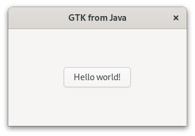
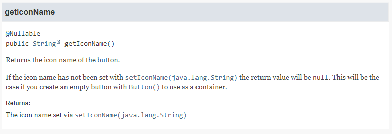

# Java-GI

**Java-GI** is a tool for generating GObject-Introspection bindings for Java. The generated bindings use the [Panama Foreign Function & Memory API](https://openjdk.org/projects/panama/) (JEP 442, currently in preview status) to directly access native resources from inside the JVM, with wrapper classes based on GObject-Introspection to offer an elegant API. Java-GI version 0.8.0 generates bindings to develop Java applications for libraries, based of the versions in GNOME Platform 45:

| Library       | Java-GI 0.7.x | Java-GI 0.8.x |
|---------------|---------------|---------------|
| OpenJDK       | 20            | 21            |
| GLib          | 2.76          | 2.78          |
| GTK           | 4.10          | 4.12          |
| LibAdwaita    | 1.3           | 1.4           |
| GStreamer     | 1.20          | 1.22          |
| GtkSourceview | 5.9           | 5.10          |
| WebkitGtk     | 2.41          | 2.42          |

Please note that Java-GI is still under active development. The bindings should not be used in a production environment yet, and the API is subject to unannounced changes. However, feel free to try out the latest release; feedback is welcome.

[For more information, visit the Java-GI website.](https://jwharm.github.io/java-gi/)

## Quickstart

- To use Java-GI in your app, add the dependency to your `gradle.build` or `pom.xml` as described [here](https://jwharm.github.io/java-gi/usage). Furthermore, you must set the Java language version to 21, and, while the Panama foreign function API is still in preview status, set the `--enable-preview` option to the compile and execution tasks. See [this `build.gradle` file](https://github.com/jwharm/java-gi-examples/blob/main/HelloWorld/build.gradle) for a complete example.

- Write, compile and run a GTK application:

```java
import org.gnome.gtk.*;
import org.gnome.gio.ApplicationFlags;

public class HelloWorld {

    public static void main(String[] args) {
        new HelloWorld(args);
    }

    private final Application app;

    public HelloWorld(String[] args) {
        app = new Application("my.example.HelloApp", ApplicationFlags.DEFAULT_FLAGS);
        app.onActivate(this::activate);
        app.run(args);
    }

    public void activate() {
        var window = new ApplicationWindow(app);
        window.setTitle("GTK from Java");
        window.setDefaultSize(300, 200);

        var box = Box.builder()
                .setOrientation(Orientation.VERTICAL)
                .setHalign(Align.CENTER)
                .setValign(Align.CENTER)
                .build();

        var button = Button.withLabel("Hello world!");
        button.onClicked(window::close);

        box.append(button);
        window.setChild(box);
        window.present();
    }
}
```

The result:



## Examples

You can find some examples [here](https://github.com/jwharm/java-gi-examples). Each example can be separately built and run with `gradle run`:

|  |  |  |  |
| ---- | ---- | ---- | ---- |
| [Web Browser](https://github.com/jwharm/java-gi-examples/tree/main/Browser)                     | [Peg Solitaire](https://github.com/jwharm/java-gi-examples/tree/main/PegSolitaire) | [Calculator](https://github.com/jwharm/java-gi-examples/tree/main/Calculator) | [Notepad](https://github.com/jwharm/java-gi-examples/tree/main/Notepad) |

## Current features

Nearly all types, functions and parameters defined in the GIR files are supported by Java-GI. Even complex function signatures with combinations of arrays, callbacks, out-parameters and varargs are available in Java.

Some interesting features of the bindings that Java-GI generates:

### Automatic memory management

Memory management of native resources is automatically taken care of. Java-GI uses GObject toggle references to dispose the native object when the Java instance is garbage-collected, and releases all other memory allocations (for strings, arrays and structs) after use.

### Javadoc

All API docstrings are translated into Javadoc, so they are directly available in your IDE.

As an example, the generated documentation of `gtk_button_get_icon_name` contains links to other methods, and specifies the return value. This is all translated to valid Javadoc:

```java
/**
 * Returns the icon name of the button.
 * <p>
 * If the icon name has not been set with {@link Button#setIconName}
 * the return value will be {@code null}. This will be the case if you create
 * an empty button with {@link Button#Button} to use as a container.
 * @return The icon name set via {@link Button#setIconName}
 */
public @Nullable java.lang.String getIconName() {
    ...
```



The Javadoc is published [online](https://jwharm.github.io/java-gi/javadoc).

### GObject type system

GObject classes are available as Java classes (obviously). The GObject TypeClass definition is an inner class in the Java class.

Interfaces are mapped to Java interfaces, using `default` interface methods to call native methods.

Type aliases (`typedef`s in C) for classes, records and interfaces are represented in Java with a subclass of the original type. Aliases for primitive types such as `int` or `float` are represented by simple wrapper classes.

Enumeration types are represented as Java `enum` types.

Most classes have one or more constructors. However, constructors in GTK are often overloaded, and the name contains valuable information for the user. Java-GI therefore maps constructors named "new" to regular Java constructors, and generates static factory methods for all other constructors:

```java
// gtk_button_new
var button1 = new Button();

// gtk_button_new_with_label
var button2 = Button.withLabel("Open...");

// gtk_button_new_from_icon_name
var button3 = Button.fromIconName("document-open");
```

Some struct types (called "records" in GObject-Introspection) don't have constructors, because in C these are meant to be stack-allocated. An example is `Gdk.RGBA`. Java-GI offers a static `allocate` method that will allocate a new struct in an [Arena](https://docs.oracle.com/en/java/javase/21/docs/api/java.base/java/lang/foreign/Arena.html) of your choice. You can either allocate an empty struct (`var color = RGBA.allocate(arena);`) and fill in the values later, or pass the values immediately: `var purple = RGBA.allocate(arena, 0.9f, 0.1f, 0.9f, 1.0f);`

### Signals, callbacks and closures

Signals are mapped to type-safe methods and objects in Java. (Detailed signals like `notify` have an extra `String` parameter.) A signal can be connected to a lambda expression or method reference:

```java
var button = Button.withLabel("Close");
button.onClicked(window::close);
```

For every signal, a method to connect (e.g. `onClicked`) and emit the signal (`emitClicked`) is included in the API. New signal connections return a `SignalConnection` object, that allows you to disconnect, block and unblock a signal, or check whether the signal is still connected.

Functions with callback parameters are supported too. The generated Java bindings contain `@FunctionalInterface` definitions for all callback functions to ensure type safety.

[Closures](https://docs.gtk.org/gobject/struct.Closure.html) are marshaled to Java methods using reflection.

### Registering new types

You can easily register a Java class as a GType:

```java
public class MyWidget extends Widget {

    public static Type gtype = Types.register(MyWidget.class);

    // Construct new instance
    public MyWidget newInstance() {
        return GObject.newInstance(gtype);
    }

    // Default constructor, used by Java-GI for marshaling
    public MyWidget(MemorySegment address) {
        super(address);
    }
}
```

You can define custom GObject properties and signals using annotations. The following example defines an `int` property named `"lives"` and a `"game-over"` signal with a `String` parameter:

```java
    @Property
    public int getLives() {
        return lives;
    }
    
    @Property
    public void setLives(int value) {
        this.lives = value;
        if (value == 0)
            emit("game-over", player.name());
    }

    @Signal
    public interface GameOver {
        void apply(String playerName);
    }
```

Java classes can implement interfaces and override methods without any additional effort. When implementing methods from an interface (or overriding virtual methods from a parent class), Java-GI will register it in the GObject type system, so native code will call your Java method too. See for example [this implementation](https://github.com/jwharm/java-gi/blob/main/modules/gio/src/main/java/io/github/jwharm/javagi/gio/ListIndexModel.java) of the `ListModel` interface, or read the [Java-GI documentation](https://jwharm.github.io/java-gi/register/) for an overview of all the possibilities.

### Composite template classes

A class with a `@GtkTemplate` annotation will be registered as a Gtk composite template class:

```java
@GtkTemplate(name="HelloWindow", ui="/my/example/hello-window.ui")
public class HelloWindow extends ApplicationWindow {

    private static Type gtype = Types.register(HelloWindow.class);

    @GtkChild(name="header_bar")
    public HeaderBar header;

    @GtkChild
    public Label label;
    
    @GtkCallback
    public void buttonClicked() {
        ...
    }

    ...
```

In the above example, the `header` and `label` fields and the `buttonClicked` callback function are all declared the `hello-window.ui` file.

You can read more about template classes in [the documentation](https://jwharm.github.io/java-gi/templates/).

### Parameters

Java-GI takes care of marshaling Java values from and to native values. When working with arrays, Java-GI will automatically copy native array contents from and to a Java array, marshaling the contents to the correct types along the way. A `null` terminator is added where applicable. You also don't need to specify the array length as a separate parameter.

Nullability of parameters (as defined in the GObject-introspection attributes) is indicated with `@Nullable` and `@NotNull` attributes, and checked at runtime. The nullability attributes are imported from Jetbrains Annotations (as a compile-time-only dependency).

Variadic functions (varargs) are supported too:

```java
Dialog d = Dialog.withButtons(
        "Test dialog",
        window,
        DialogFlags.MODAL,
        "Accept",
        ResponseType.ACCEPT,
        "Cancel",
        ResponseType.CANCEL,
        null
);
d.show();
```

Out-parameters are mapped to a simple `Out<T>` container-type in Java, that offers typesafe `get()` and `set()` methods to retrieve or modify the value.

```java
File file = ...
Out<byte[]> contents = new Out<byte[]>();
file.loadContents(null, contents, null));
System.out.printf("Read %d bytes%n", contents.get().length);
```

### Builder pattern

You can construct an object with properties using a Builder pattern. In the "Hello World" app above, it's used to create a `Box`. It can be used for any other type too:

```java
var window = ApplicationWindow.builder()
    .setApplication(this)
    .setTitle("Window")
    .setDefaultWidth(300)
    .setDefaultHeight(200)
    .build();
```

Java-GI generates builders for all classes. In a builder, you can set the properties of the class, its parents, and all implemented interfaces.

### Exceptions

`GError` parameters are mapped to Java `GErrorException`s.

```java
try {
    file.replaceContents(contents, null, false, FileCreateFlags.NONE, null, null);
} catch (GErrorException e) {
    e.printStackTrace();
}
```

### Portability

The Java-GI bindings are cross-platform: You can use the same jar on all supported operating systems (Linux, Windows and MacOS) provided that the native libraries are installed. Platform-specific types and methods (like `Gtk.PrintUnixDialog`) check the operating system at runtime and throw an `UnsupportedPlatformException` when necessary.

## Building and Contributing

To build Java-GI for yourself, make changes, or use Java-GI to generate bindings for other (GObject-Introspection based) libraries, follow the instructions [here](https://jwharm.github.io/java-gi/generate/).

## Known issues

The bindings are still under active development and have not been thoroughly tested yet. The most notable issues and missing features are currently:

- Java does not distinguish between signed and unsigned data types. Be extra careful when native code returns, for example, a `guint`.
- Java-GI makes heavy use of [Cleaners](https://docs.oracle.com/en/java/javase/21/docs/api/java.base/java/lang/ref/Cleaner.html) to free memory or decrease an object's refcount. Cleaners are triggered during garbage collection of a Java instance. However, Java doesn't guarantee when, and if, the GC will run, and what it will clean, leading to memory leaks.
- Some functions (like `Gio.DesktopAppInfo.search`) work with nested arrays (`gchar***`). Marshalling these arrays from and to Java `String[][]` values isn't supported yet.
