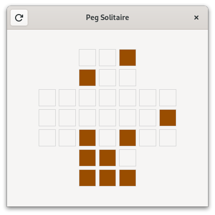
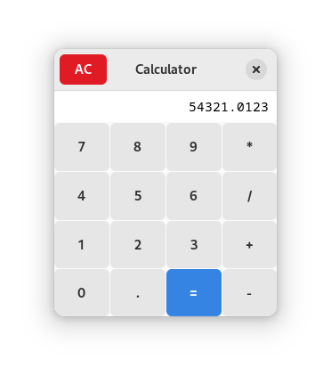
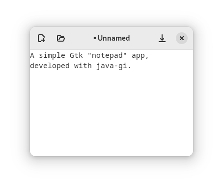

# Java-GI

**Java-GI** is a tool for generating GObject-Introspection bindings for Java. The generated bindings use the [Panama Foreign Function & Memory API](https://openjdk.org/projects/panama/) (JEP 434, currently in preview status) to directly access native resources from inside the JVM, with wrapper classes based on GObject-Introspection to offer an elegant API. Java-GI version 0.5.1 generates bindings to develop Java applications with the following libraries:

| Library    | Version |
|------------|---------|
| GLib       | 2.76    |
| GTK        | 4.10    |
| LibAdwaita | 1.3     |
| GStreamer  | 1.20    |

Please note that Java-GI is still under active development. The bindings should not be used in a production environment yet, and the API is subject to unannounced changes. However, feel free to try out the latest release; feedback is welcome.

[For more information, visit the Java-GI website.](https://jwharm.github.io/java-gi/)

## Quickstart

To use Java-GI in your app, you need to specify a few things in your `gradle.build` file:

- Set the Java language version to 20

- Add the [JitPack](https://jitpack.io) repository in your root `build.gradle` at the end of repositories:

```groovy
allprojects {
	repositories {
		...
		maven { url 'https://jitpack.io' }
	}
}
```

- Add the following dependencies to your `build.gradle` file:

```groovy
dependencies {
    compileOnly 'org.jetbrains:annotations:24.+'
    implementation 'com.github.jwharm.java-gi:glib:v0.5.1'
    implementation 'com.github.jwharm.java-gi:gtk:v0.5.1'
    implementation 'com.github.jwharm.java-gi:adwaita:v0.5.1'
    implementation 'com.github.jwharm.java-gi:gstreamer:v0.5.1'
}
```

- While the Panama foreign function API is still in preview status, set the `--enable-preview` option to the compile and execution tasks. To suppress warnings about native access, also add `--enable-native-access=ALL-UNNAMED`.

See [this `build.gradle` file](https://github.com/jwharm/java-gi-examples/blob/main/Calculator/build.gradle) for a complete example.

- If your application has a `module-info.java` file, add `requires org.gnome.gtk;` to it.
- Write, compile and run a GTK application:

```java
import org.gnome.gtk.*;
import org.gnome.gio.ApplicationFlags;

public class HelloWorld {

    public static void main(String[] args) {
        new HelloWorld(args);
    }

    private final Application app;

    public HelloWorld(String[] args) {
        app = new Application("my.example.HelloApp", ApplicationFlags.DEFAULT_FLAGS);
        app.onActivate(this::activate);
        app.run(args);
    }

    public void activate() {
        var window = new ApplicationWindow(app);
        window.setTitle("GTK from Java");
        window.setDefaultSize(300, 200);

        var box = Box.builder()
            .setOrientation(Orientation.VERTICAL)
            .setHalign(Align.CENTER)
            .setValign(Align.CENTER)
            .build();

        var button = Button.newWithLabel("Hello world!");
        button.onClicked(window::close);

        box.append(button);
        window.setChild(box);
        window.present();
    }
}
```

The result:


It is recommended to download the Javadoc documentation and sources to assist during the development of your GTK application. The original docstrings have been transformed to Javadoc syntax, so they are really nice to use.

## Examples

You can find some examples [here](https://github.com/jwharm/java-gi-examples). Each example can be separately built and run with `gradle run`:

|  |  |  |  |
| ---- | ---- | ---- | ---- |
| [Hello World](https://github.com/jwharm/java-gi-examples/tree/main/HelloWorld) | [Peg Solitaire](https://github.com/jwharm/java-gi-examples/tree/main/PegSolitaire) | [Calculator](https://github.com/jwharm/java-gi-examples/tree/main/Calculator) | [Notepad](https://github.com/jwharm/java-gi-examples/tree/main/Notepad) |

## Features

Nearly all types, functions and parameters defined in the GIR files for Gtk, LibAdwaita and GStreamer are supported by Java-GI. Even complex function signatures with combinations of arrays, callbacks, out-parameters and varargs are available in Java.

Some interesting features of the bindings that Java-GI generates:

### Javadoc

All API docstrings are translated into Javadoc, so they are directly available in your IDE.

As an example, the generated documentation of `gtk_button_get_icon_name` contains links to other methods, and specifies the return value. This is all translated to valid Javadoc:

```java
/**
 * Returns the icon name of the button.
 * <p>
 * If the icon name has not been set with {@link Button#setIconName}
 * the return value will be {@code null}. This will be the case if you create
 * an empty button with {@link Button#Button} to use as a container.
 * @return The icon name set via {@link Button#setIconName}
 */
public @Nullable java.lang.String getIconName() {
    ...
```


The Javadoc is also published online:

- [GLib](https://jwharm.github.io/java-gi/glib/org.gnome.glib/module-summary.html)
- [Gtk](https://jwharm.github.io/java-gi/gtk/org.gnome.gtk/module-summary.html)
- [Adwaita](https://jwharm.github.io/java-gi/adwaita/org.gnome.adwaita/module-summary.html)
- [GStreamer](https://jwharm.github.io/java-gi/gstreamer/org.freedesktop.gstreamer/module-summary.html)

### Classes and Interfaces

GObject classes are available as Java classes (obviously). The GObject TypeClass definition is an inner class in the Java class.

Interfaces are mapped to Java interfaces, using `default` interface methods to call native methods.

Type aliases (`typedef`s in C) for classes, records and interfaces are represented in Java with a subclass of the original type. Aliases for primitive types such as `int` or `float` are represented by simple wrapper classes.

Enumeration types are represented as Java `enum` types.

Most classes have one or more constructors. However, constructors in GTK are often overloaded, and the name contains valuable information for the user. Java-GI therefore maps constructors named "new" to regular Java constructors, and generates static factory methods for all other constructors:

```java
// gtk_button_new
var button1 = new Button();

// gtk_button_new_with_label
var button2 = Button.newWithLabel("Open...");

// gtk_button_new_from_icon_name
var button3 = Button.newFromIconName("document-open");
```

Some struct types (also called "records" in GObject jargon) don't have constructors, because in C these are meant to be stack-allocated. An example is `Gdk.RGBA`. Java-GI offers a static `allocate` method that will allocate a new struct that you can use. You can either allocate an empty struct (`var color = RGBA.allocate();`) and fill in the values later, or pass the values immediately: `var purple = RGBA.allocate(0.9f, 0.1f, 0.9f, 1.0f);`

### Automatic memory management

Memory management of native resources is automatically taken care of. Java-GI uses GObject toggle references to dispose the native object when the Java instance is garbage-collected, and releases all other memory allocations (for strings, arrays and structs) after use.

### Signals, callbacks and closures

Signals are mapped to type-safe methods and objects in Java. (Detailed signals like `notify` have an extra `String` parameter.) A signal can be connected to a lambda expression or method reference:

```java
var button = Button.newWithLabel("Close");
button.onClicked(window::close);
```

For every signal, a method to connect (e.g. `onClicked`) and emit the signal (`emitClicked`) is included in the API. New signal connections return a `Signal` object, that allows you to disconnect, block and unblock a signal, or check whether the signal is still connected.

Functions with callback parameters are supported too. The generated Java bindings contain `@FunctionalInterface` definitions for all callback functions to ensure type safety.

[Closures](https://docs.gtk.org/gobject/struct.Closure.html) are marshaled to Java methods using reflection.

### Registering new types

You can easily register a Java class as a GType:

```java
public class MyWidget extends Widget {

    public static Type gtype = Types.register(MyWidget.class);

    // Construct new instance
    public MyWidget newInstance() {
        return GObject.newInstance(gtype);
    }

    // Default constructor, used by Java-GI for marshaling
    public MyWidget(Addressable address) {
        super(address);
    }
}
```

You can define custom GObject Properties with an annotation:

```java
    @Property(name="my-number", type=ParamSpecInt.class)
    public int getMyNumber() {
        return ...;
    }
    
    @Property(name="my-number") {
    public void setMyNumber(int number) {
        ...
    }
    
```

Java classes can implement interfaces and override methods without any additional effort. You can override any method you want; however, when you override methods from an interface (or virtual methods from a parent class), Java-GI will register it in the GObject type system, so native code will call your Java method too. An [example implementation](https://github.com/jwharm/java-gi/blob/main/glib/main/java/io/github/jwharm/javagi/util/ListIndexModel.java) of the `ListModel` interface is included in the GLib module.

Read [the documentation](https://jwharm.github.io/java-gi/register/) for an overview of all the possibilities.

### Composite template classes

A class with a `@GtkTemplate` annotation will be registered as a Gtk composite template class:

```java
@GtkTemplate(name="HelloWindow", ui="/my/example/hello-window.ui")
public class HelloWindow extends ApplicationWindow {

    private static Type gtype = Types.register(HelloWindow.class);

    @GtkChild(name="header_bar")
    public HeaderBar header;

    @GtkChild
    public Label label;
    
    @GtkCallback
    public void buttonClicked() {
        ...
    }

    ...
```

In the above example, the `header` and `label` fields and the `buttonClicked` callback function are all declared the `hello-window.ui` file.

You can read more about template classes in [the documentation](https://jwharm.github.io/java-gi/templates/).

### Parameters

Java-GI takes care of marshaling Java values from and to native values. When working with arrays, Java-GI will automatically copy native array contents from and to a Java array, marshaling the contents to the correct types along the way. A `null` terminator is added where applicable. You also don't need to specify the array length as a separate parameter.

Nullability of parameters (as defined in the GObject-introspection attributes) is indicated with `@Nullable` and `@NotNull` attributes, and checked at runtime. The nullability attributes are imported from Jetbrains Annotations (as a compile-time-only dependency).

Variadic functions (varargs) are supported too:

```java
Dialog d = Dialog.newWithButtons(
        "Test dialog",
        window,
        DialogFlags.MODAL,
        "Accept",
        ResponseType.ACCEPT,
        "Cancel",
        ResponseType.CANCEL,
        null
);
d.show();
```

Out-parameters are mapped to a simple `Out<T>` container-type in Java, that offers typesafe `get()` and `set()` methods to retrieve or modify the value.

```java
File file = ...
Out<byte[]> contents = new Out<byte[]>();
file.loadContents(null, contents, null));
System.out.printf("Read %d bytes\n", contents.get().length);
```

### Builder pattern

You can construct an object with properties using a Builder pattern. In the "Hello World" app above, it's used to create a `Box`. It can be used for any other type too:

```java
var window = ApplicationWindow.builder()
    .setApplication(this)
    .setTitle("Window")
    .setDefaultWidth(300)
    .setDefaultHeight(200)
    .build();
```

Java-GI generates builders for all classes. In a builder, you can set the properties of the class, its parents, and all implemented interfaces.

### Exceptions

`GError` parameters are mapped to Java `GErrorException`s.

```java
try {
    file.replaceContents(contents, null, false, FileCreateFlags.NONE, null, null);
} catch (GErrorException e) {
    e.printStackTrace();
}
```

The Java-GI bindings are cross-platform: You can use the same jar on all supported operating systems (Linux, Windows and MacOS) provided that the native libraries are installed. Platform-specific types and methods (like `Gtk.PrintUnixDialog`) check the operating system at runtime and throw an `UnsupportedPlatformException` when neccessary.

## Building and Contributing

If you want to generate and build Java-GI bindings by yourself, follow these steps:
- Clone the Java-GI project from GitHub.
- Download and install [JDK 20](https://jdk.java.net/20/).
- Run `./bld all download publish`.

Java-GI uses `bld` (from [Rife2](https://rife2.com/bld)) to build. `bld` is a pure java build tool that is very easy to use. You don't need to install it separately; the included wrapper will download it the first time.

During the build process, the [gircore/gir-files](https://github.com/gircore/gir-files) repository is cloned into the `build/gir-files` folder. The gir-core repository contains GIR files for GLib, Gtk, GStreamer, LibAdwaita and some other commonly used libraries for Linux, Windows and MacOS and is regularly updated. You can find the gir files in `build/gir-files`. Once downloaded, subsequent builds will run `git pull` instead of `git clone`.

The resulting jar files are located in the `build/dist` folder, and also published in the MavenLocal repository.

If you want to build a specific module, run `./bld [modulename] [command]`. Running just `./bld` will display a list of all options. Example usage:

| Command                                 | Result                                                          |
|-----------------------------------------|-----------------------------------------------------------------|
| `./bld`                                 | Display all available commands                                  |
| `./bld clean`                           | Clean the build artifacts                                       |
| `./bld download`                        | Download dependencies                                           |
| `./bld glib gtk compile`                | Generate and compile bindings for GLib and Gtk                  |
| `./bld all compile`                     | Shorthand to compile bindings for all modules                   |
| `./bld gtk jar jar-javadoc jar-sources` | Create jar, javadoc.jar and sources.jar for Gtk                 |
| `./bld glib gstreamer publish`          | Publish jar, javadoc.jar and sources.jar for GLib and GStreamer |

## Known issues

The bindings are still under active development and have not been thoroughly tested yet. The most notable issues and missing features are currently:

- Java does not distinguish between signed and unsigned data types. Be extra careful when native code returns, for example, a `guint`.
- There are still a few memory leaks.
- Some functions (like `Gio.DesktopAppInfo.search`) work with nested arrays (`gchar***`). These aren't supported yet.
