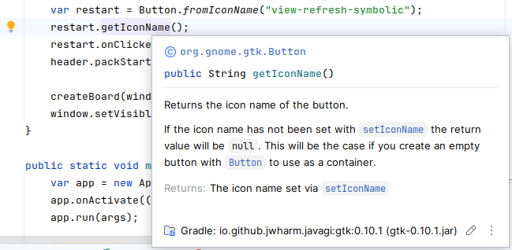

# Java-GI

**Java-GI** is a tool for generating GObject-Introspection bindings for Java. The generated bindings use the [Foreign Function & Memory API](https://openjdk.org/projects/panama/) (JEP 454) to access native resources from Java, with wrapper classes based on GObject-Introspection to offer an elegant API. Java-GI version 0.14.* generates bindings to develop Java applications for libraries, based of the versions in GNOME Platform 48:

| Library       | Version |
|---------------|---------|
| GLib          | 2.86    |
| GTK           | 4.20    |
| LibAdwaita    | 1.8     |
| GStreamer     | 1.26    |
| GtkSourceview | 5.18    |
| WebkitGtk     | 2.50    |

You can generate Java bindings for other libraries with the `java-gi` [command-line tool](https://jwharm.github.io/java-gi/generate/) on the GIR (introspection data) file.

Please note that Java-GI is still under active development, and the API is subject to unannounced changes. Feedback is welcome!

[For more information, visit the Java-GI website.](https://jwharm.github.io/java-gi/)

## Usage

Let's write a small "Hello World" GTK application:

```java
import org.gnome.gtk.*;
import org.gnome.gio.ApplicationFlags;

public class HelloWorld {
    private final Application app;

    public static void main(String[] args) {
        new HelloWorld(args);
    }

    public HelloWorld(String[] args) {
        app = new Application("my.example.HelloApp", ApplicationFlags.DEFAULT_FLAGS);
        app.onActivate(this::activate);
        app.run(args);
    }

    public void activate() {
        var window = new ApplicationWindow(app);
        window.setTitle("GTK from Java");
        window.setDefaultSize(300, 200);

        var box = Box.builder()
                     .setOrientation(Orientation.VERTICAL)
                     .setHalign(Align.CENTER)
                     .setValign(Align.CENTER)
                     .build();

        var button = Button.withLabel("Hello world!");
        button.onClicked(window::close);

        box.append(button);
        window.setChild(box);
        window.present();
    }
}
```

Add the Gtk dependency to your build script, for example with Gradle:

```groovy
repositories {
    mavenCentral()
}

dependencies {
    implementation 'org.java-gi:gtk:0.14.1'
}
```

The result:


## Examples

You can find some examples [here](https://github.com/jwharm/java-gi-examples). Each example can be separately built and run with `gradle run`:

|  |  |  |  |
| ---- | ---- | ---- | ---- |
| [Web Browser](https://github.com/jwharm/java-gi-examples/tree/main/Browser)                     | [Peg Solitaire](https://github.com/jwharm/java-gi-examples/tree/main/PegSolitaire) | [Calculator](https://github.com/jwharm/java-gi-examples/tree/main/Calculator) | [Notepad](https://github.com/jwharm/java-gi-examples/tree/main/Notepad) |

The [java-gi-app-template](https://github.com/jwharm/java-gi-app-template) repository offers a ready-to-run GNOME application template with translations, resources, settings, icons and much more. The template is setup to be built and installed as a Flatpak application.

## Generate bindings for other libraries

Java-GI offers a command-line utility to generate bindings for any library that supports GObject-Introspection. It is documented [here](https://jwharm.github.io/java-gi/generate/).

## Current features

Nearly all types, functions and parameters defined in a GIR file are supported by Java-GI. Even complex function signatures with combinations of arrays, callbacks, out-parameters and varargs are available in Java.

Some interesting features of the bindings that Java-GI generates:

### Automatic memory management

Memory management of native resources is automatically taken care of. Java-GI uses GObject toggle references to dispose the native object when the Java instance is garbage-collected, and releases all other memory allocations (for strings, arrays and structs) after use.

### Javadoc

All API docstrings are translated into Javadoc, so they are directly available in your IDE.

As an example, the generated documentation of `gtk_button_get_icon_name` contains links to other methods, and specifies the return value. This is all translated to valid Javadoc.



The Javadoc is published [online](https://jwharm.github.io/java-gi/javadoc).

### GObject type system

GObject classes are available as Java classes (obviously). The GObject TypeClass definition is an inner class in the Java class.

Interfaces are mapped to Java interfaces, using `default` interface methods to call native methods.

Type aliases (`typedef`s in C) for classes, records and interfaces are represented in Java with a subclass of the original type. Aliases for primitive types such as `int` or `float` are represented by simple wrapper classes.

Enumerations are represented as Java `enum` types, and flag (bitfield) parameters are mapped to `EnumSet`.

Most classes have one or more constructors. However, constructors in GTK are often overloaded, and the name contains valuable information for the user. Java-GI therefore maps constructors named "new" to regular Java constructors, and generates static factory methods for all other constructors:

```java
// gtk_button_new
var button1 = new Button();

// gtk_button_new_with_label
var button2 = Button.withLabel("Open...");

// gtk_button_new_from_icon_name
var button3 = Button.fromIconName("document-open");
```

Many struct types don't have constructors, because in C they are meant to be stack-allocated. Java-GI adds constructors that will allocate a new struct in an [Arena](https://docs.oracle.com/en/java/javase/25/docs/api/java.base/java/lang/foreign/Arena.html) of your choice. You can either allocate an empty struct (`var color = new RGBA();`) and fill in the values later, or pass the values immediately: `var purple = new RGBA(0.9f, 0.1f, 0.9f, 1.0f);`

### Signals, callbacks and closures

Signals are mapped to type-safe methods and objects in Java. (Detailed signals like `notify` have an extra `String` parameter.) A signal can be connected to a lambda expression or method reference:

```java
var button = Button.withLabel("Close");
button.onClicked(window::close);
```

For every signal, a method to connect (e.g. `onClicked`) and emit the signal (`emitClicked`) is included in the API. New signal connections return a `SignalConnection` object, that allows you to disconnect, block and unblock a signal, or check whether the signal is still connected.

Functions with callback parameters are supported too. The generated Java bindings contain `@FunctionalInterface` definitions for all callbacks to ensure type safety.

Java-GI can create [GClosures](https://docs.gtk.org/gobject/struct.Closure.html) (dynamically-typed callbacks) using the [JavaClosure](https://java-gi.org/javadoc/org/javagi/gobject/JavaClosure.html) class, which uses reflection to marshal and unmarshal method- or lambda parameters to and from `GValues	` as required for a GClosure.

### Registering new types

Java-GI registers GObject-derived Java classes as a GType. When overriding virtual methods from a parent class (or implementing methods from an interface), Java-GI will register that in the GObject type system, so native code will call your Java method too. JavaBeans-style getter and setter method pairs are registered as GObject properties. You can also define your own custom signals, using the "@Signal" annotation. The following example defines an `int` property named `"lives"` and a `"game-over"` signal with a `String` parameter:

```java
public class Player extends GObject {
    private String name;
    private int lives;

    public int getLives() {
        return lives;
    }
    
    public void setLives(int value) {
        this.lives = value;
        if (value == 0)
            emit("game-over", this.name);
    }

    @Signal
    public interface GameOver {
        void apply(String playerName);
    }
}
```

Read the [Java-GI documentation](https://jwharm.github.io/java-gi/register/) for an overview of all the possibilities.

### Composite template classes

A class with a `@GtkTemplate` annotation will be registered as a Gtk composite template class:

```java
@GtkTemplate(ui="/my/example/hello-window.ui")
public class HelloWindow extends ApplicationWindow {

    @GtkChild(name="header_bar")
    public HeaderBar header;

    @GtkChild
    public Label label;
    
    @GtkCallback
    public void buttonClicked() {
        ...
    }
}
```

In the above example, the `header_bar` and `label` elements and the `buttonClicked` callback function are all connected to the `hello-window.ui` file.

You can read more about template classes in [the documentation](https://jwharm.github.io/java-gi/templates/).

### Parameters

Java-GI takes care of marshaling Java values from and to native values. When working with arrays, Java-GI will automatically copy native array contents from and to a Java array, marshaling the contents to the correct types along the way. A `null` terminator is added where applicable. You also don't need to specify the array length as a separate parameter.

Nullability of parameters (as defined in the GObject-introspection attributes) is indicated with JSpecify `@NullMarked` and `@Nullable` attributes, and checked at runtime.

Variadic functions (varargs) are supported too:

```java
Dialog d = Dialog.withButtons(
        "Test dialog",
        window,
        DialogFlags.MODAL,
        "Accept",
        ResponseType.ACCEPT,
        "Cancel",
        ResponseType.CANCEL,
        null
);
d.show();
```

Out-parameters are mapped to a simple `Out<T>` container-type in Java, that offers typesafe `get()` and `set()` methods to retrieve or modify the value.

```java
File file = ...
Out<byte[]> contents = new Out<byte[]>();
if (file.loadContents(null, contents, null))) {
    System.out.printf("Read %d bytes%n", contents.get().length);
}
```

### Builder pattern

You can construct an object with properties using a Builder pattern. In the "Hello World" app above, it's used to create a `Box`. It can be used for any other type too:

```java
var window = ApplicationWindow.builder()
    .setApplication(this)
    .setTitle("Window")
    .setDefaultWidth(300)
    .setDefaultHeight(200)
    .build();
```

Java-GI generates builders for all classes. In a builder, you can set the properties of the class, its parents, and all implemented interfaces.

### Exceptions

`GError` parameters are mapped to Java `GErrorException`s.

```java
try {
    file.replaceContents(contents, null, false, FileCreateFlags.NONE, null, null);
} catch (GErrorException e) {
    ... // handle exception
}
```

### Portability

The published bindings are cross-platform: You can use the same jar on all supported operating systems (64-bit Linux, Windows and MacOS) provided that the native libraries are installed, but be careful not to use platform-specific types and functions if you care about cross-platform compatibility.

## Pitfalls

- Java does not distinguish between signed and unsigned data types. Be extra careful when native code returns, for example, a `guint`.
- Java-GI uses [Cleaners](https://docs.oracle.com/en/java/javase/21/docs/api/java.base/java/lang/ref/Cleaner.html) to free memory or decrease an object's refcount. Cleaners are triggered during garbage collection of a Java instance. However, Java doesn't guarantee when, and if, the GC will run, which means that it can be hard to predict when (and if) native memory is released.
