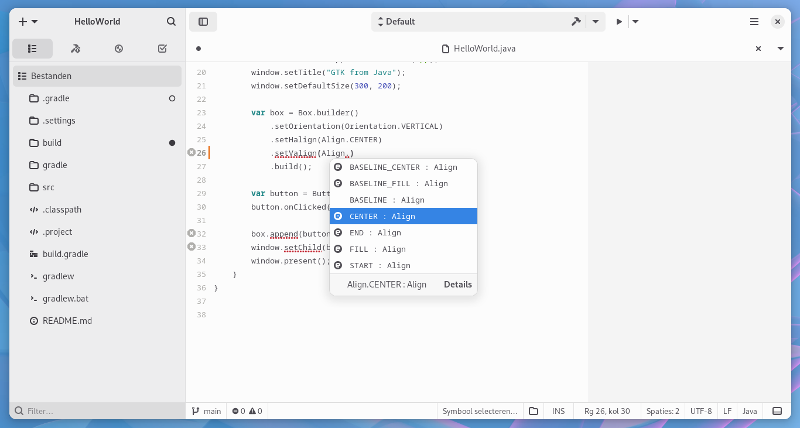

# Advanced usage

## Memory management

In most cases, memory management of native resources is automatically taken care of. Java-GI uses GObject toggle references to dispose the native object when the Java instance is garbage-collected, and manages all memory allocations for marshaling of string, array and struct parameters.

### Allocating structs with an Arena
Struct and union definitions (in contrast to GObjects) in native code are mapped to Java classes.

Because structs don't necessarily have a constructor method, the Java classes offer two constructors to allocate a new struct:
- A constructor without parameters, that will allocate an uninitialized structs
- A constructor with parameters to set all struct members to an initial value

The constructors optionally take an `Arena` to specify how to allocate memory for the new instances in native memory. Users can choose between different arenas in OpenJDK, depending on the use case. The constructors generated by Java-GI default to `Arena.ofAuto()`. Some examples:

=== "Java"

    ```java
    try (var arena = Arena.ofConfined()) {
        var p1 = new Point(10, 10, arena);
        // memory is now allocated
    }
    // memory is now deallocated

    var p2 = new Point(20, 10, Arena.ofAuto());
    // memory will be deallocated when the variable is garbage collected

    var p3 = new Point(30, 10);
    // defaults to Arena.ofAuto()

    var p4 = new Point(40, 10, Arena.global());
    // memory will be allocated during the entire application runtime
    ```

=== "Kotlin"

    ```kotlin
    Arena.ofConfined().use { arena ->
        var p1 = Point(10, 10, arena)
        // memory is now allocated
    }
    // memory is now deallocated

    var p2 = Point(20, 10, Arena.ofAuto())
    // memory will be deallocated when the variable is garbage collected

    var p3 = Point(30, 10)
    // defaults to Arena.ofAuto()

    var p4 = Point(40, 10, Arena.global())
    // memory will be allocated during the entire application runtime
    ```

!!! warning
    The Java garbage collector does not know about the native resources, and might wait an indefinite amount of time before the objects are effectively disposed. Therefore, the default `Arena.ofAuto()` can lead to excessive memory usage. When allocating and discarding many struct instances in a tight loop, use `Arena.ofConfined()` or `Arena.ofShared()` with a `try {}` block to explicitly manage the memory allocations.
    Read the [OpenJDK Arena class documentation](https://docs.oracle.com/en/java/javase/22/docs/api/java.base/java/lang/foreign/Arena.html) to learn how to use arenas to manage the lifecycle of native memory segments.

## Builder pattern

You can construct an object with GObject properties using a Builder pattern. For example, to create a new ApplicationWindow:

=== "Java"

    ```java
    var window = ApplicationWindow.builder()
        .setApplication(this)
        .setTitle("Window")
        .setDefaultWidth(300)
        .setDefaultHeight(200)
        .build();
    ```

=== "Kotlin"

    ```kotlin
    val window = ApplicationWindow.builder()
        .setApplication(this)
        .setTitle("Window")
        .setDefaultWidth(300)
        .setDefaultHeight(200)
        .build()
    ```

With a `Builder` you can set the properties of the class, its parents, and all implemented interfaces. Behind the scenes, this will call `g_object_new_with_properties()`.

Builders also offer `on...()` methods to connect signals:

=== "Java"

    ```java
    var button = Button.builder()
        .setLabel("Close window")
        .onClicked(window::close)
        .build()
    ```

=== "Kotlin"

    ```kotlin
    val button = Button.builder()
        .setLabel("Close window")
        .onClicked(window::close)
        .build()
    ```

This can result in cleaner-looking code, but the signals cannot be managed and disconnected. To properly connect and disconnect signals, use the `SignalHandler` object that is returned by the `on...()` methods on the created instances. You should only connect signals from a builder when they don't need to be disconnected later.

## Property bindings

Use `GObject.bindProperty()` to create a property binding, so that when one property value is modified, the other one is updated too. It's also possible to apply transformations in both directions:

```java
button1.<Integer, Integer>bindProperty("number", button2, "number")
       .transformTo(n -> n + 1)
       .transformFrom(n -> n - 1)
       .bidirectional()
       .syncCreate()
       .build();
```

This example binds the "number" property of `button1` to the "number" property of `button2`. The generic type declaration `<Integer, Integer>` contains the types of the properties.

## Exceptions

`GError**` parameters are mapped to Java `GErrorException`s.

=== "Java"

    ```java
    try {
        file.replaceContents(contents, null, false, FileCreateFlags.NONE, null, null);
    } catch (GErrorException e) {
        // handle exception
    }
    ```

=== "Kotlin"

    ```kotlin
    try {
        file.replaceContents(contents, null, false, FileCreateFlags.NONE, null, null)
    } catch (e: GErrorException) {
        // handle exception
    }
    ```

Use `GErrorException.getCode()`, `getDomain()` and `getMessage()` to get the GError code, domain and message. Java-GI does not generate separate Exception types for different GError domains, because the domain is only set at runtime.

## Nullable/NotNull parameter annotations

Nullability of parameters (as defined in the GObject-introspection attributes) is indicated with `@Nullable` and `@NotNull` attributes, and checked at runtime. The nullability annotations are imported from Jetbrains Annotations.

## Arrays

Java-GI copies all array parameters into a newly allocated array in native memory. When an array is returned, the contents are copied back into a Java array. This impacts performance, so keep this in mind when working with arrays in a tight loop.

C functions that work with arrays, often expect the length as an additional parameter. In the corresponding Java methods, that parameter is omitted, because Java-GI will set it automatically.

## Out-parameters

Out-parameters are mapped to a simple `Out<T>` container-type in Java, that offers typesafe `get()` and `set()` methods to retrieve or modify the value.

=== "Java"

    ```java
    File file = ...
    Out<byte[]> contents = new Out<byte[]>();
    file.loadContents(null, contents, null);
    System.out.printf("Read %d bytes%n", contents.get().length);
    ```

=== "Kotlin"

    ```kotlin
    val file: File = ...
    val contents: Out<byte[]> = Out<byte[]>()
    file.loadContents(null, contents, null)
    println("Read ${contents.get().length} bytes");
    ```

## Enums and flags

Enumerations and flags (bitfields) are available as Java enums. To combine multiple flags, use `Set.of()`:

=== "Java"

    ```java
    entry.setInputHints(Set.of(InputHints.WORD_COMPLETION, InputHints.NO_SPELLCHECK));
    ```

=== "Kotlin"

    ```kotlin
    entry.inputHints = setOf(InputHints.WORD_COMPLETION, InputHints.NO_SPELLCHECK)
    ```

When the flags are the last parameter, you can omit `Set.of()` and pass the flags directly als variadic arguments. All methods with flags as the last parameter are overloaded for this purpose:

=== "Java"

    ```java
    entry.setInputHints(InputHints.WORD_COMPLETION, InputHints.NO_EMOJI);
    ```

=== "Kotlin"

    ```kotlin
    entry.setInputHints(InputHints.WORD_COMPLETION, InputHints.NO_EMOJI)
    ```


!!! note
    The Java `EnumSet` class can be useful when working with flags. It is specialized for use with enum types and provides useful operations like `allOf()` and `noneOf()`. It can also be much faster, in comparison to other `Set` classes.

## Varargs

Variadic functions are available in Java using varargs:

=== "Java"

    ```java
    Dialog d = Dialog.withButtons(
            "Test dialog",
            window,
            DialogFlags.MODAL,
            "Accept",
            ResponseType.ACCEPT,
            "Cancel",
            ResponseType.CANCEL,
            null
    );
    d.show();
    ```

=== "Kotlin"

    ```kotlin
    val d = Dialog.withButtons(
            "Test dialog",
            window,
            DialogFlags.MODAL,
            "Accept",
            ResponseType.ACCEPT,
            "Cancel",
            ResponseType.CANCEL,
            null
    )
    d.show()
    ```

Be aware that with most variadic functions in GLib, you are expected to add `null` as a final parameter.

!!! note
    Java-GI does not provide bindings for functions with a `va_list` parameter.

## Signals and callbacks

Signals are mapped to type-safe methods and objects in Java. (Detailed signals like `notify` have an extra `String` parameter.) A signal can be connected to a lambda expression or method reference:

=== "Java"

    ```java
    var button = Button.withLabel("Close");
    button.onClicked(window::close);
    ```

=== "Kotlin"

    ```kotlin
    val button = Button.withLabel("Close")
    button.onClicked(window::close)
    ```

For every signal, a method to connect (e.g. `onClicked`) and emit the signal (`emitClicked`) is included in the API. New signal connections return a `SignalConnection` object, that allows you to disconnect, block and unblock a signal, or check whether the signal is still connected. It is useful to disconnect signals after they are no longer used, because the signal callback keeps the source object alive. Disconnecting the signal allows the related resources to be released.

Functions with callback parameters are supported too. The generated Java bindings contain `@FunctionalInterface` definitions for all callback functions to ensure type safety.

To learn about creating your own signals, read [Registering new types](register.md).

## Closures

[Closures](https://docs.gtk.org/gobject/struct.Closure.html) can be marshaled to Java methods. Similar to the `CClosure` type in C code, Java-GI offers a [JavaClosure](https://java-gi.org/javadoc/org/javagi/gobject/JavaClosure.html). You can create a JavaClosure for a lambda fuction, functional interface or `java.lang.reflect.Method`, and then pass it to native code (for example, the last two parameters of [`GObject.bindPropertyFull()`](https://jwharm.github.io/java-gi/javadoc/org/gnome/gobject/GObject.html#bindPropertyWithClosures(java.lang.String,org.gnome.gobject.GObject,java.lang.String,java.util.Set,org.gnome.gobject.Closure,org.gnome.gobject.Closure)).

!!! warning
    Be aware that a Java lambda or method reference that is wrapped in a JavaClosure must have the correct type signature, or else the application will fail at runtime. Closures cannot be type-checked by the compiler!

## Registering a new type

Registering a Java class as a new GType is documented [here](register.md).

## Creating a Gtk composite template class

To create a Gtk composite template class (coupled to a ui definition in XML or Blueprint format), read [these instructions](templates.md).

## GNOME Builder



A great tool for developing GNOME applications is GNOME Builder. Builder primarily supports C, JavaScript, Rust, Python and Vala applications, but you can use it to develop Java applications as well, if you have the Eclipse JDT language server (JDTLS) installed.

!!! warning
    In my limited experience this is still very unpolished and fragile. For any serious work, by all means use a well-supported Java IDE.

1. Install GNOME Builder. Preferably the newest release from Flathub, but at least version 44.
2. Download JDTLS [here](https://download.eclipse.org/jdtls/milestones/). Pick the latest milestone version and download the file `jdt-language-server-...-tar.gz`.
3. Extract the downloaded file into a local directory.
4. Add the `[jdtls folder]/jdtls/bin` to your `$PATH`. The easiest way to do that, is with a symlink like this: `ln -s ~/Downloads/jdt-language-server-1.35.0-202404251256/bin/jdtls ~/.local/bin/jdtls`
5. Start GNOME Builder and open a Java project.
6. Open a `.java` file. Builder will spawn the JDT language server and will display "Initialize Workspace". This might take a few minutes.
7. When the initialization has completed, you can develop and build your Java project with GNOME Builder.

