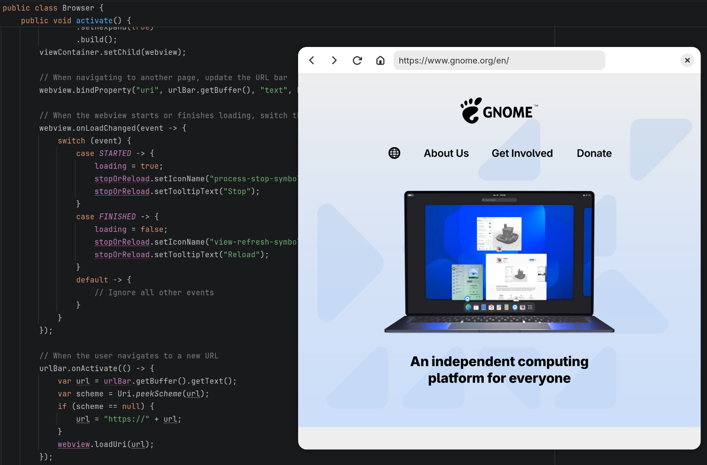

# Welcome to Java-GI

Java-GI generates Java bindings for native libraries including Gtk, LibAdwaita, GtkSourceview, WebkitGtk and GStreamer using GObject-Introspection data. The bindings use the new Foreign Function & Memory API (JEP-454) to directly access native resources from inside the JVM.

Please note that Java-GI is still under active development. Feedback is welcome.

## How to use

* [Basic usage](usage.md) and [example applications](examples.md)

* [Registering new GTypes](register.md)

* [Creating composite template classes](templates.md)

* [Generating bindings for other libraries](generate.md)

## Supported 

Java-GI requires OpenJDK 22 or newer. It have been built with the following library versions:

| Library       | Java-GI 0.14.x | Java-GI 0.12.x & 0.13.x | Java-GI 0.11.x | Java-GI 0.10.x |
|---------------|---------------:|------------------------:|---------------:|---------------:|
| GNOME         | 49             | 48                      | 47             | 46             |
| GLib          | 2.86           | 2.84                    | 2.82           | 2.80           |
| GTK           | 4.20           | 4.18                    | 4.16           | 4.14           |
| LibAdwaita    | 1.8            | 1.7                     | 1.6            | 1.5            |
| GStreamer     | 1.26           | 1.24                    | 1.24           | 1.22           |
| GtkSourceview | 5.18           | 5.16                    | 5.14           | 5.12           |
| WebkitGtk     | 2.50           | 2.48                    | 2.46           | 2.44           |

The Java bindings for these libraries are available from [Maven Central](https://central.sonatype.com/search?namespace=org.java-gi).

## API documentation

Java-GI converts API documentation from GObject-Introspection to Javadoc. For the library bindings published by Java-GI, [the Javadoc is available online](https://jwharm.github.io/java-gi/javadoc).

JAR files with the Javadoc and source code, to use offline in your IDE, are available from Maven Central.

## Example apps

You can find example applications in the [java-gi-examples repository](https://github.com/jwharm/java-gi-examples).

The [java-gi-app-template](https://github.com/jwharm/java-gi-app-template) repository offers a ready-to-run GNOME application template with translations, resources, settings, icons and much more. The template is setup to be built and installed as a Flatpak application.

## Contributing

To build Java-GI for yourself, make changes, or use Java-GI to generate bindings for other (GObject-Introspection based) libraries, follow the instructions [here](https://jwharm.github.io/java-gi/generate/). Please log issues, questions and requests on [Github](https://github.com/jwharm/java-gi), or join the discussion on [Matrix](https://matrix.to/#/#java-gi:matrix.org).
