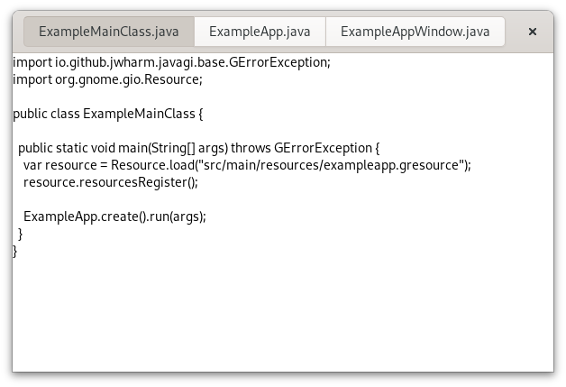

In this step, we make our application show the content of all the files that it is given on the commandline.

To this end, we can run the application with `gradle run --args='...'` but for the purposes of this guide, we will add the args to the `run` task in the buildfile:

```groovy
tasks.named('run') {
    jvmArgs += "--enable-native-access=ALL-UNNAMED"
    args = ["ExampleApp",
            "src/main/java/ExampleMainClass.java",
            "src/main/java/ExampleApp.java",
            "src/main/java/ExampleAppWindow.java"]
}
```

!!! warning
    Following C conventions, Gtk expects the first argument to be the program name, but this is not the case in Java applications. To solve this, we add the program name "ExampleApp" back as the first argument, followed by the files to open (in this case, we simply open some of the source code files of our application).

Next, we add a `stack` field to our application window subclass, with a `@GtkChild` annotation. The `Types.register()` method internally uses the {{ doc('func@Gtk.widget_class_bind_template_child') }} function to arrange things so that after instantiating the template, the `stack` field will point to the widget of the same name from the template.

```java
...

@GtkTemplate(ui="/org/gtk/exampleapp/window.ui")
public class ExampleAppWindow extends ApplicationWindow {

  private static final Type gtype = Types.register(ExampleAppWindow.class);

  @GtkChild
  public Stack stack;

...
```

Now we revisit the `ExampleAppWindow.open()` method that is called for each commandline argument, and construct a Gtk.TextView that we then add as a page to the stack:

```java
...

public void open(File file) {
  String basename = file.getBasename();

  var view = new TextView();
  view.setEditable(false);
  view.setCursorVisible(false);
  
  var scrolled = new ScrolledWindow();
  scrolled.setHexpand(true);
  scrolled.setVexpand(true);
  scrolled.setChild(view);
  stack.addTitled(scrolled, basename, basename);

  try {
    var contents = new Out<byte[]>();
    if (file.loadContents(null, contents, null)) {
      var buffer = view.getBuffer();
      String str = new String(contents.get());
      buffer.setText(str, str.length());
    }
  } catch (GErrorException e) {
    throw new RuntimeException(e);
  }
}

...
```

Lastly, we add a {{ javadoc('Gtk.StackSwitcher') }} to the titlebar area in the UI file, and we tell it to display information about our stack.

```xml
<child type="titlebar">
  <object class="GtkHeaderBar" id="header">
    <child type="title">
      <object class="GtkStackSwitcher" id="tabs">
        <property name="stack">stack</property>
      </object>
    </child>
  </object>
</child>
```

[Full source](part3)

The stack switcher gets all its information it needs to display tabs from the stack that it belongs to. Here, we are passing the label to show for each file as the last argument to the {{ javadoc('Stack.addTitled') }} method.

Our application is beginning to take shape:



[Previous](getting_started_07.md){ .md-button } [Next](getting_started_09.md){ .md-button }
