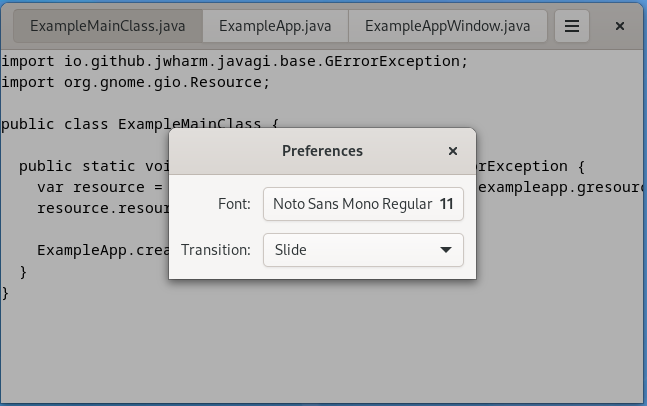

A typical application will have a some preferences that should be remembered from one run to the next. Even for our simple example application, we may want to change the font that is used for the content.

We are going to use {{ javadoc('Gio.Settings') }} to store our preferences. `GSettings` requires a schema that describes our settings:

```xml
<?xml version="1.0" encoding="UTF-8"?>
<schemalist>
  <schema path="/org/gtk/exampleapp/" id="org.gtk.exampleapp">
    <key name="font" type="s">
      <default>'Monospace 12'</default>
      <summary>Font</summary>
      <description>The font to be used for content.</description>
    </key>
    <key name="transition" type="s">
      <choices>
        <choice value='none'/>
        <choice value='crossfade'/>
        <choice value='slide-left-right'/>
      </choices>
      <default>'none'</default>
      <summary>Transition</summary>
      <description>The transition to use when switching tabs.</description>
    </key>
  </schema>
</schemalist>
```

Before we can make use of this schema in our application, we need to compile it into the binary form that GSettings expects. GIO provides macros to do this in Autotools-based projects, and the gnome module of the Meson build system provides the [`gnome.compile_schemas()`](https://mesonbuild.com/Gnome-module.html#gnomecompile_schemas) method for this task. We can't simply add a Gradle task to do this, because the schemas are installed globally so this step needs root (system administrator) permissions. It is possible to do this manually, by copying the XML file into `/usr/share/glib-2.0/schemas` and then running `glib-compile-schemas` as root:

```
sudo cp src/main/resources/org.gtk.exampleapp.gschema.xml /usr/share/glib-2.0/schemas/
sudo glib-compile-schemas /usr/share/glib-2.0/schemas/
```

!!! note
    Installing Gtk applications built with Java-GI is still work in progress. A possible solution could be to simply use Meson for installation, using Gradle to configure and build the Java application. Alternatively, an installer can be created using the `jpackage` tool.

Next, we need to connect our settings to the widgets that they are supposed to control. One convenient way to do this is to use `GSettings` bind functionality to bind settings keys to object properties, as we do here for the transition setting.

```java
import org.gnome.gio.Settings;
...

@InstanceInit
public void init() {
  ...
  
  settings = new Settings("org.gtk.exampleapp");
  settings.bind("transition", stack, "transition-type", SettingsBindFlags.DEFAULT);
}

...
```

Take care to import `org.gnome.gio.Settings` instead of `org.gnome.gtk.Settings`.

The code to connect the font setting is a little more involved, since there is no simple object property that it corresponds to, so we are not going to go into that here.

At this point, the application will already react if you change one of the settings, e.g. using the `gsettings` command line tool. Of course, we expect the application to provide a preference dialog for these. So lets do that now. Our preference dialog will be a subclass of {{ javadoc('Gtk.Dialog') }}, and we'll use the same techniques that we've already seen: templates, `@GtkChild` fields, settings bindings.

Lets start with the template.

```xml
<?xml version="1.0" encoding="UTF-8"?>
<interface>
  <template class="ExampleAppPrefs" parent="GtkDialog">
    <property name="title" translatable="yes">Preferences</property>
    <property name="resizable">0</property>
    <property name="modal">1</property>
    <child internal-child="content_area">
      <object class="GtkBox" id="content_area">
        <child>
          <object class="GtkGrid" id="grid">
            <property name="margin-start">12</property>
            <property name="margin-end">12</property>
            <property name="margin-top">12</property>
            <property name="margin-bottom">12</property>
            <property name="row-spacing">12</property>
            <property name="column-spacing">12</property>
            <child>
              <object class="GtkLabel" id="fontlabel">
                <property name="label">_Font:</property>
                <property name="use-underline">1</property>
                <property name="mnemonic-widget">font</property>
                <property name="xalign">1</property>
                <layout>
                  <property name="column">0</property>
                  <property name="row">0</property>
                </layout>
              </object>
            </child>
            <child>
              <object class="GtkFontButton" id="font">
                <layout>
                  <property name="column">1</property>
                  <property name="row">0</property>
                </layout>
              </object>
            </child>
            <child>
              <object class="GtkLabel" id="transitionlabel">
                <property name="label">_Transition:</property>
                <property name="use-underline">1</property>
                <property name="mnemonic-widget">transition</property>
                <property name="xalign">1</property>
                <layout>
                  <property name="column">0</property>
                  <property name="row">1</property>
                </layout>
              </object>
            </child>
            <child>
              <object class="GtkComboBoxText" id="transition">
                <items>
                  <item translatable="yes" id="none">None</item>
                  <item translatable="yes" id="crossfade">Fade</item>
                  <item translatable="yes" id="slide-left-right">Slide</item>
                </items>
                <layout>
                  <property name="column">1</property>
                  <property name="row">1</property>
                </layout>
              </object>
            </child>
          </object>
        </child>
      </object>
    </child>
  </template>
</interface>
```

Next comes the dialog subclass. (Import statements have been omitted for brevity.)

```java
@GtkTemplate(ui="/org/gtk/exampleapp/prefs.ui")
public class ExampleAppPrefs extends Dialog {

  private static final Type gtype = Types.register(ExampleAppPrefs.class);

  public static Type getType() {
    return gtype;
  }

  public ExampleAppPrefs(MemorySegment address) {
    super(address);
  }

  @GtkChild
  public FontButton font;

  @GtkChild
  public ComboBoxText transition;

  Settings settings;

  @InstanceInit
  public void init() {
    settings = new Settings("org.gtk.exampleapp");
    settings.bind("font", font, "font", SettingsBindFlags.DEFAULT);
    settings.bind("transition", transition, "active-id", SettingsBindFlags.DEFAULT);
  }

  public static ExampleAppPrefs create(ExampleAppWindow win) {
    return GObject.newInstance(getType(),
        "transient-for", win,
        "use-header-bar", 1,
        null);
  }
}
```

Now we revisit the `preferencesActivated()` method in our application
class, and make it open a new preference dialog.

```java
...

public void preferencesActivated(Variant parameter) {
  ExampleAppWindow win = (ExampleAppWindow) getActiveWindow();
  ExampleAppPrefs prefs = ExampleAppPrefs.create(win);
  prefs.present();
}

...
```

[Full source](part6)

After all this work, our application can now show a preference dialog like this:



[Previous](getting_started_09.md){ .md-button } [Next](getting_started_11.md){ .md-button }
