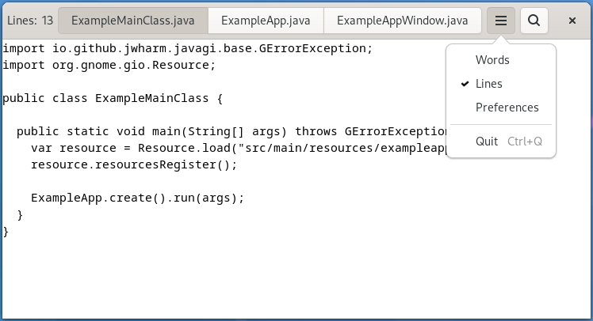

Widgets and other objects have many useful properties.

Here we show some ways to use them in new and flexible ways, by wrapping them in actions with {{ javadoc('Gio.PropertyAction') }} or by binding them with {{ javadoc('GObject.Binding') }}.

To set this up, we add two labels to the header bar in our window template, named `lines_label` and `lines`, and bind them to struct members in the private struct, as we've seen a couple of times by now.

We add a new "Lines" menu item to the gears menu, which triggers the show-lines action:

```xml
<?xml version="1.0" encoding="UTF-8"?>
<interface>
  <menu id="menu">
    <section>
      <item>
        <attribute name="label" translatable="yes">_Words</attribute>
        <attribute name="action">win.show-words</attribute>
      </item>
      <item>
        <attribute name="label" translatable="yes">_Lines</attribute>
        <attribute name="action">win.show-lines</attribute>
      </item>
      <item>
        <attribute name="label" translatable="yes">_Preferences</attribute>
        <attribute name="action">app.preferences</attribute>
      </item>
    </section>
    <section>
      <item>
        <attribute name="label" translatable="yes">_Quit</attribute>
        <attribute name="action">app.quit</attribute>
      </item>
    </section>
  </menu>
</interface>
```

To make this menu item do something, we create a property action for the visible property of the `lines` label, and add it to the actions of the window. The effect of this is that the visibility of the label gets toggled every time the action is activated.

Since we want both labels to appear and disappear together, we bind the visible property of the `lines_label` widget to the same property of the `lines` widget.

```java
...

@InstanceInit
public void init() {
  ...

    addAction(new PropertyAction("show-lines", lines, "visible"));
    lines.bindProperty("visible", lines_label, "visible", BindingFlags.DEFAULT);
}

...
```

We also need a function that counts the lines of the currently active tab, and updates the `lines` label. See the [full source](part9)
 if you are interested in the details.

This brings our example application to this appearance:



[Previous](getting_started_12.md){ .md-button }
